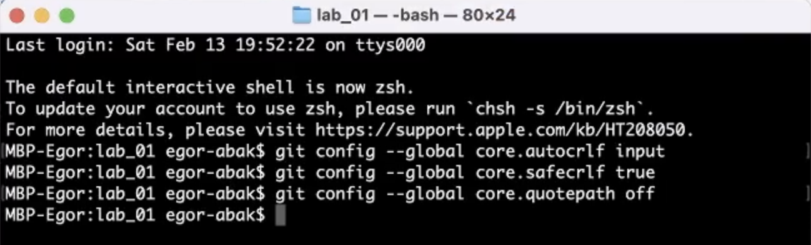
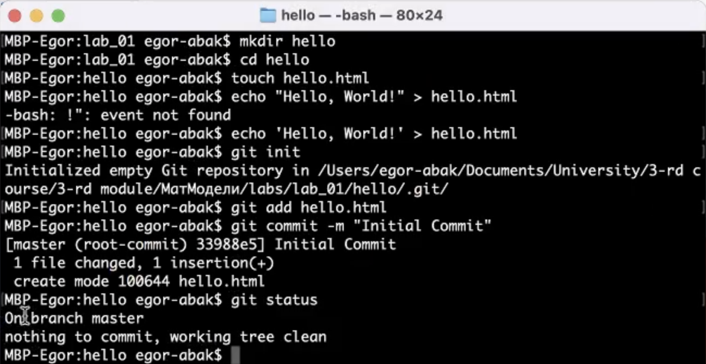
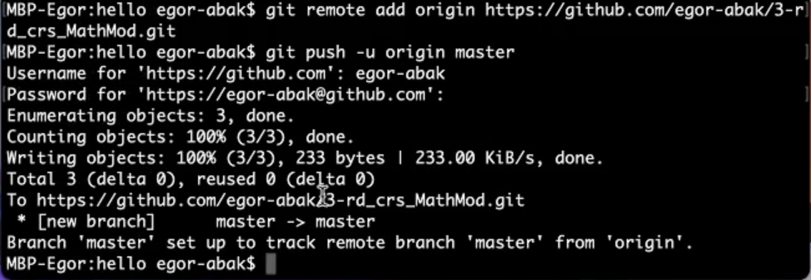
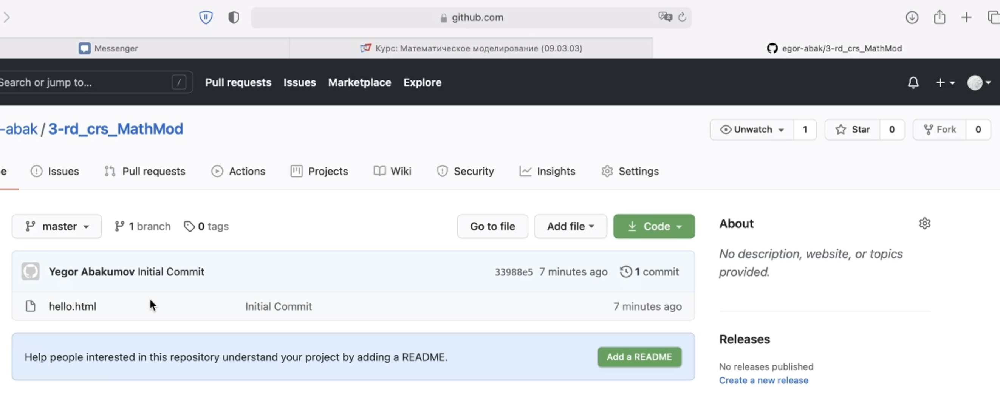
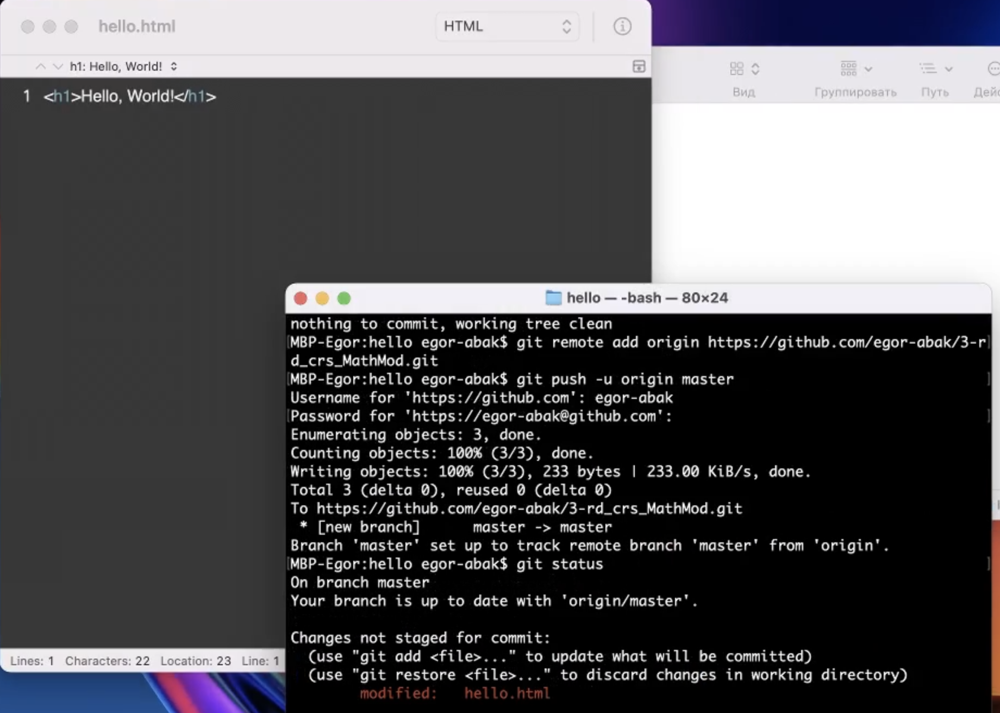
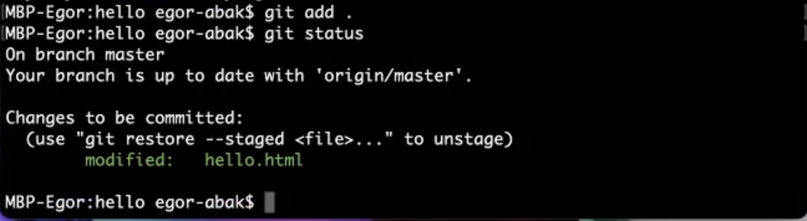
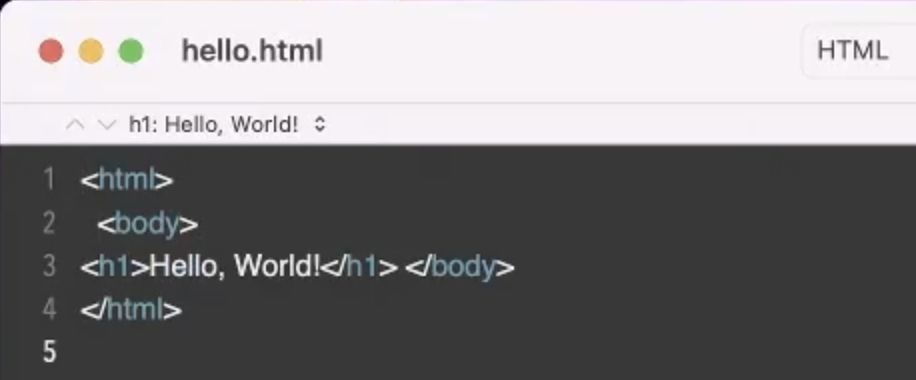
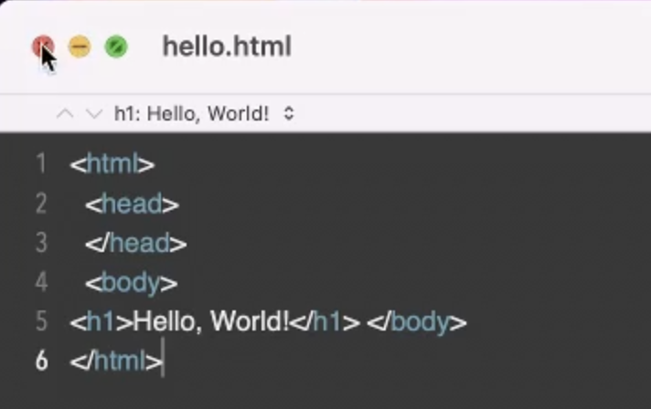
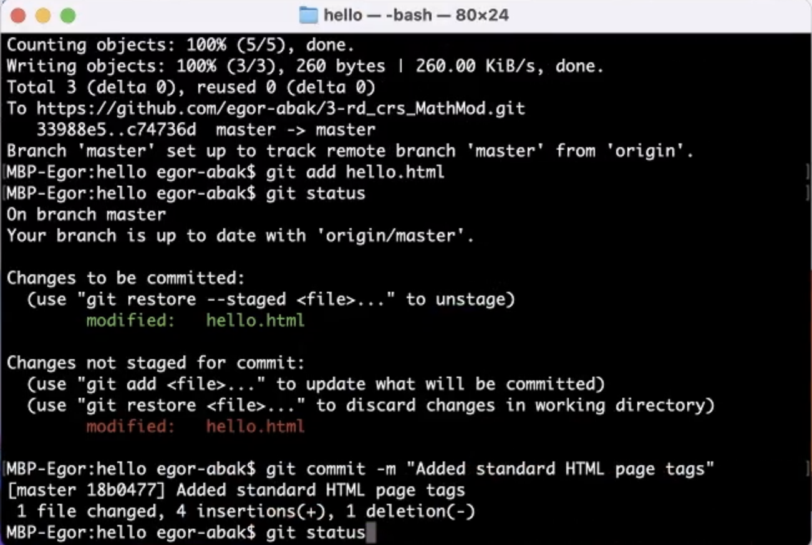
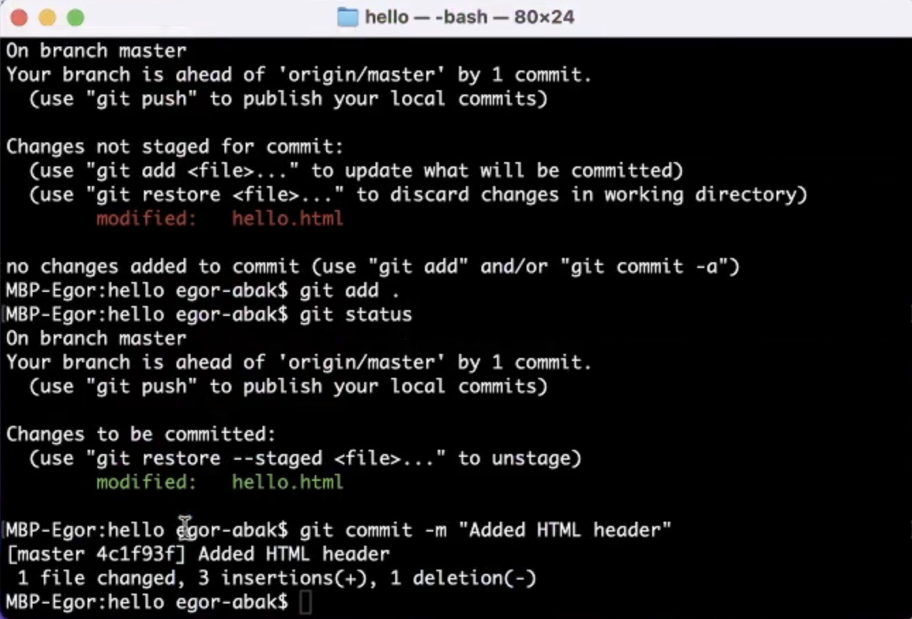

---
# Front matter
lang: ru-RU
title: "Отчёт по лабораторной работе №1"
subtitle: "Использование системы контроля версий git и ресурса GitHub в рабочем процессе"
author: "Абакумов Егор Александрович"

# Formatting
toc-title: "Содержание"
toc: true # Table of contents
toc_depth: 2
lof: true # List of figures
lot: true # List of tables
fontsize: 12pt
linestretch: 1.5
papersize: a4paper
documentclass: scrreprt
polyglossia-lang: russian
polyglossia-otherlangs: english
mainfont: PT Serif
romanfont: PT Serif
sansfont: PT Sans
monofont: PT Mono
mainfontoptions: Ligatures=TeX
romanfontoptions: Ligatures=TeX
sansfontoptions: Ligatures=TeX,Scale=MatchLowercase
monofontoptions: Scale=MatchLowercase
indent: true
pdf-engine: lualatex
header-includes:
  - \linepenalty=10 # the penalty added to the badness of each line within a paragraph (no associated penalty node) Increasing the value makes tex try to have fewer lines in the paragraph.
  - \interlinepenalty=0 # value of the penalty (node) added after each line of a paragraph.
  - \hyphenpenalty=50 # the penalty for line breaking at an automatically inserted hyphen
  - \exhyphenpenalty=50 # the penalty for line breaking at an explicit hyphen
  - \binoppenalty=700 # the penalty for breaking a line at a binary operator
  - \relpenalty=500 # the penalty for breaking a line at a relation
  - \clubpenalty=150 # extra penalty for breaking after first line of a paragraph
  - \widowpenalty=150 # extra penalty for breaking before last line of a paragraph
  - \displaywidowpenalty=50 # extra penalty for breaking before last line before a display math
  - \brokenpenalty=100 # extra penalty for page breaking after a hyphenated line
  - \predisplaypenalty=10000 # penalty for breaking before a display
  - \postdisplaypenalty=0 # penalty for breaking after a display
  - \floatingpenalty = 20000 # penalty for splitting an insertion (can only be split footnote in standard LaTeX)
  - \raggedbottom # or \flushbottom
  - \usepackage{float} # keep figures where there are in the text
  - \floatplacement{figure}{H} # keep figures where there are in the text
---

# Цель работы

Ознакомление и получение навыков по работе с системой контроля версий Git и ресурсом GitHub.

# Задание

Провести несколько ознакомительных команд с git, настроить репозиторий для дальшейшей работы.

# Выполнение лабораторной работы

Ссылка на видео выполнения работы: https://youtu.be/hrDOKldUzOw

Начинаем с настройки рабочей области. Для этого прописываем параметры окончаний строк (иллюстр. -@fig:001).

{ #fig:001 width=70% }

Далее создаем в папке "hello"  файл и помещаем в него текст "Hello, world!". Создаем репозиторий, индексируем изменения и отправляем первый коммит (иллюстр. -@fig:002).

{ #fig:002 width=70% }

Соединяем заранее созданный на GitHub пустой репозиторий и наш локальный в одно целое. Теперь отправляем новую версию в сеть командой "push" (иллюстр. -@fig:003).

{ #fig:003 width=70% }

Проверяем на сайте, все видим (иллюстр. -@fig:004).

{ #fig:004 width=70% }

Теперь изменим файл "hello.html" и проверим статус. Видим, что изменения не были проиндексированы – красный цвет ссылки (иллюстр. -@fig:005).

{ #fig:005 width=70% }

Теперь командой "add" проиндексируем изменения и проверим статус – все успешно, теперь ссылка зеленая (иллюстр. -@fig:006).

{ #fig:006 width=70% }

Добавим к тексту в файле стандартные теги "body" и "html" (иллюстр. -@fig:007), после чего проиндексируем изменения и снова модифицируем файл, добавив еще и тег заголовка "head" (иллюстр. -@fig:008). Теперь видим в статусе, что есть проиндексированные и непроиндексироанные изменения (иллюстр. -@fig:009). После коммита остались только непроиндексированные, которые мы также сохраняем (иллюстр. -@fig:010).

{ #fig:007 width=70% }

{ #fig:008 width=70% }

{ #fig:009 width=70% }

{ #fig:010 width=70% }

Дальнейшие дополнительные действия с репозиторием выполнялись в видео, приложенном к отчету (ссылка в начале документа).

# Выводы

В процессе выполнения работы успешно был настроен репозиторий на GitHub для дальнейшей работы, а также отработаны навыки по управлению системой контроля версий.

