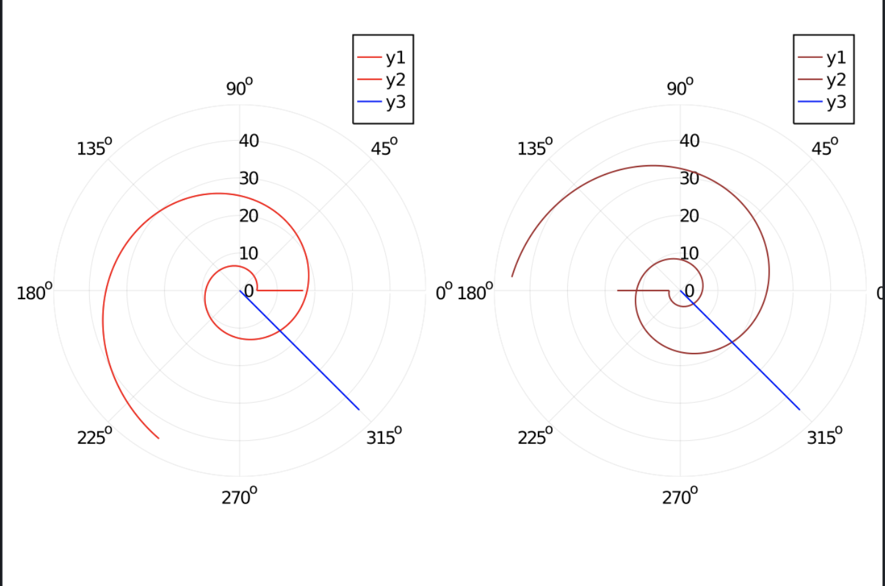
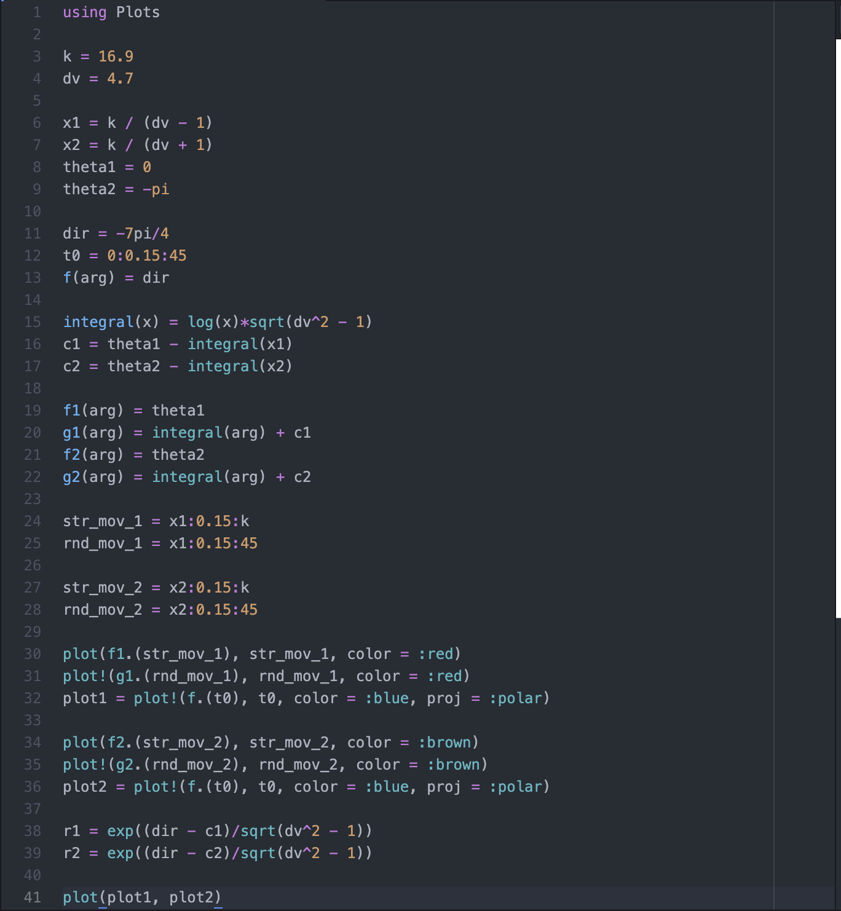

---
## Front matter
lang: ru-RU
title: "Лабораторная работа № 2"
subtitle: "Задача о погоне"
author: "Абакумов Егор Александрович"

## Formatting
toc: false
slide_level: 2
theme: metropolis
header-includes: 
 - \metroset{progressbar=frametitle,sectionpage=progressbar,numbering=fraction}
 - '\makeatletter'
 - '\beamer@ignorenonframefalse'
 - '\makeatother'
aspectratio: 43
section-titles: true
---

## Задача о погоне

Задача о погоне представляет собой несложную задачу о моделировании.
  
## Условие

 На море в тумане катер береговой охраны преследует лодку браконьеров. Через определенный промежуток времени туман рассеивается, и лодка обнаруживается на расстоянии 16,9 км от катера. Затем лодка снова скрывается в тумане и уходит прямолинейно в неизвестном направлении. Известно, что скорость катера в 4,7 раза больше скорости браконьерской лодки.

## Графики 
  
{ #fig:1 width=70% }

## Код программы

{ #fig:2 width=70% }

## Итог

  - Графики получены
  
  - Задача решена
  
  - Значения получены

  