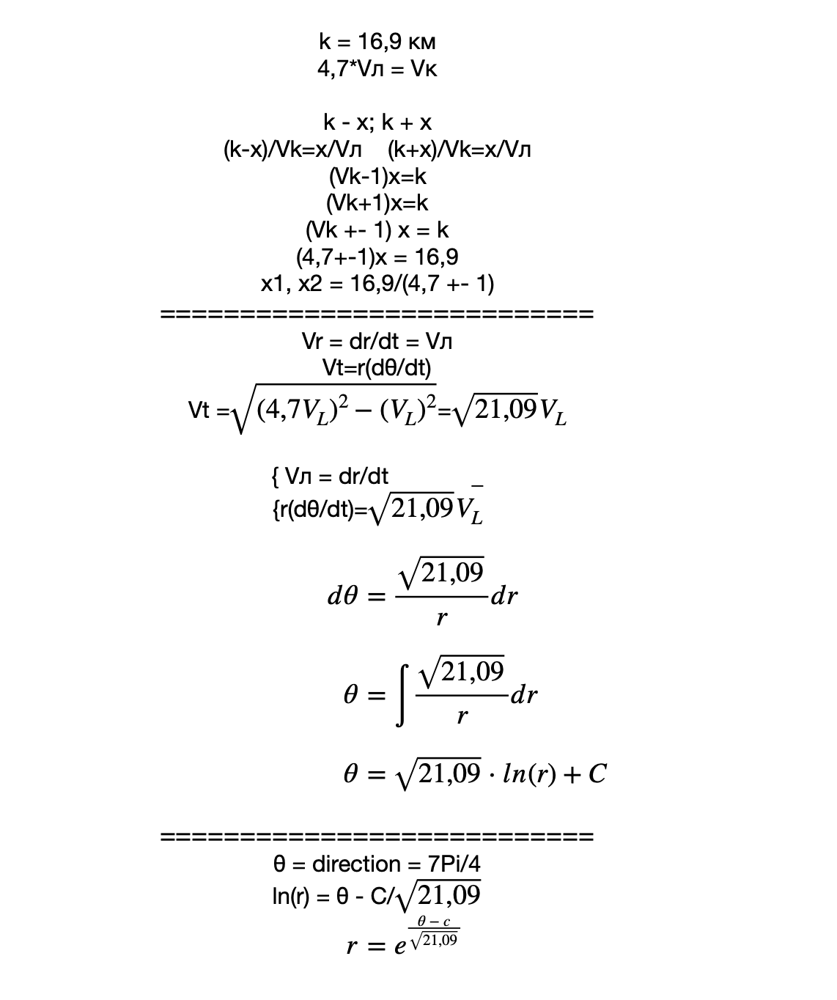
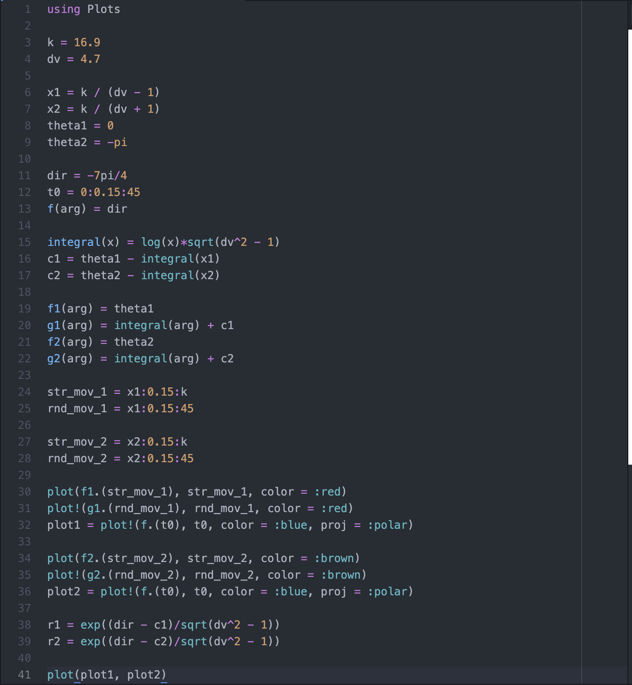
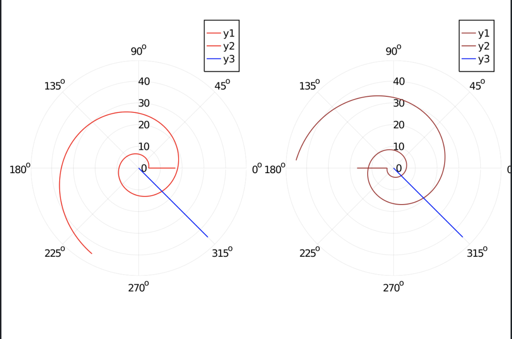

---
# Front matter
lang: ru-RU
title: "Отчёт по лабораторной работе №2"
subtitle: "Задача о погоне"
author: "Абакумов Егор Александрович"

# Formatting
toc-title: "Содержание"
toc: true # Table of contents
toc_depth: 2
lof: true # List of figures
lot: true # List of tables
fontsize: 12pt
linestretch: 1.5
papersize: a4paper
documentclass: scrreprt
polyglossia-lang: russian
polyglossia-otherlangs: english
mainfont: PT Serif
romanfont: PT Serif
sansfont: PT Sans
monofont: PT Mono
mainfontoptions: Ligatures=TeX
romanfontoptions: Ligatures=TeX
sansfontoptions: Ligatures=TeX,Scale=MatchLowercase
monofontoptions: Scale=MatchLowercase
indent: true
pdf-engine: lualatex
header-includes:
  - \linepenalty=10 # the penalty added to the badness of each line within a paragraph (no associated penalty node) Increasing the value makes tex try to have fewer lines in the paragraph.
  - \interlinepenalty=0 # value of the penalty (node) added after each line of a paragraph.
  - \hyphenpenalty=50 # the penalty for line breaking at an automatically inserted hyphen
  - \exhyphenpenalty=50 # the penalty for line breaking at an explicit hyphen
  - \binoppenalty=700 # the penalty for breaking a line at a binary operator
  - \relpenalty=500 # the penalty for breaking a line at a relation
  - \clubpenalty=150 # extra penalty for breaking after first line of a paragraph
  - \widowpenalty=150 # extra penalty for breaking before last line of a paragraph
  - \displaywidowpenalty=50 # extra penalty for breaking before last line before a display math
  - \brokenpenalty=100 # extra penalty for page breaking after a hyphenated line
  - \predisplaypenalty=10000 # penalty for breaking before a display
  - \postdisplaypenalty=0 # penalty for breaking after a display
  - \floatingpenalty = 20000 # penalty for splitting an insertion (can only be split footnote in standard LaTeX)
  - \raggedbottom # or \flushbottom
  - \usepackage{float} # keep figures where there are in the text
  - \floatplacement{figure}{H} # keep figures where there are in the text
---

# Цель работы

Смоделировать задачу о погоне, получить уравнение для двух случаев, построить графики и получить точки пересечения траекторий.

# Теоретическое обоснование

Задача решается с применением полярной системы координат. 
Вводим полярную систему на позицию лодки в момент обнаружения. Далее помещаем ось координат через местоположение катера. Тут получаем две позиции: по направлению оси и против. 
Катер будет двигаться по направлению к лодке до тех пор, пока расстояние до центра между ним и лодкой не станет равно. Тогда он начнет двигаться по спирали к лодке.
# Задание

Вариант 50.
На море в тумане катер береговой охраны преследует лодку браконьеров. Через определенный промежуток времени туман рассеивается, и лодка обнаруживается на расстоянии 16.9 км от катера. Затем лодка снова скрывается в тумане и уходит прямолинейно в неизвестном направлении. Известно, что скорость катера в 4.7 раза больше скорости браконьерской лодки.

# Выполнение лабораторной работы

Сначала приведем теоретические рассчеты и выведем уравнение (рис. -@fig:001)

{ #fig:001 width=70% }

Используя язык Julia и среду Atom пишем программу для построения графиков (рис. -@fig:002)

{ #fig:002 width=70% }

Получим графики для произвольно выбранного направления движения лодки (рис. -@fig:003)

{ #fig:003 width=70% }

# Выводы

В ходе работы мы успешно решили задачу о погоне, получили графики и числовые значения решения для заданной модели.
