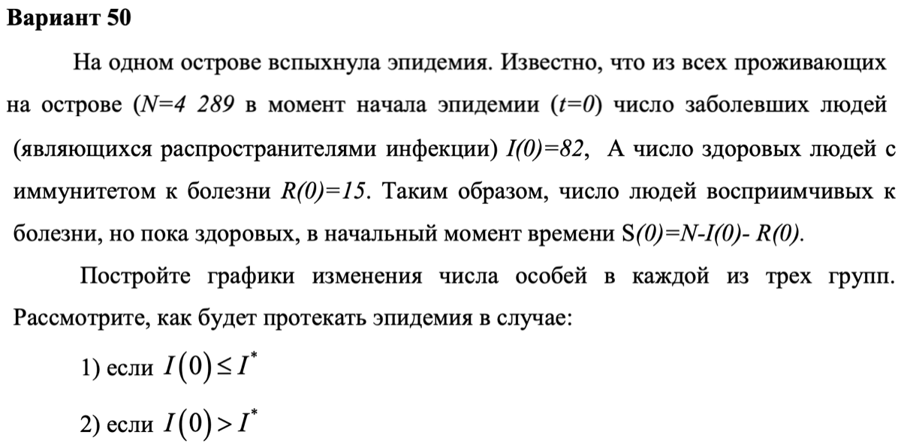
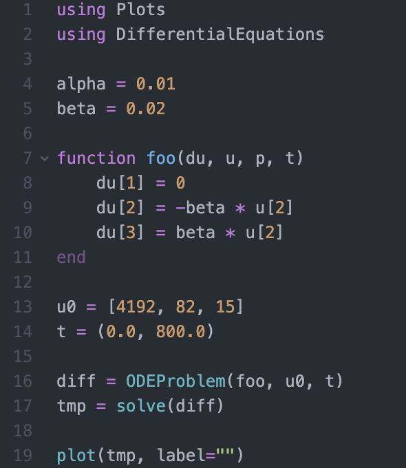
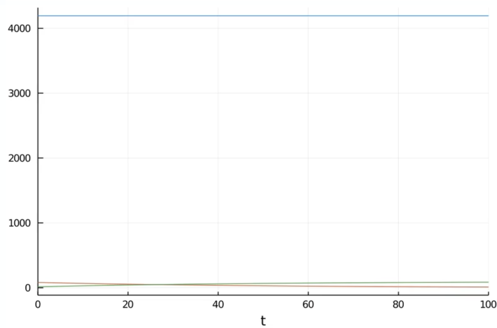
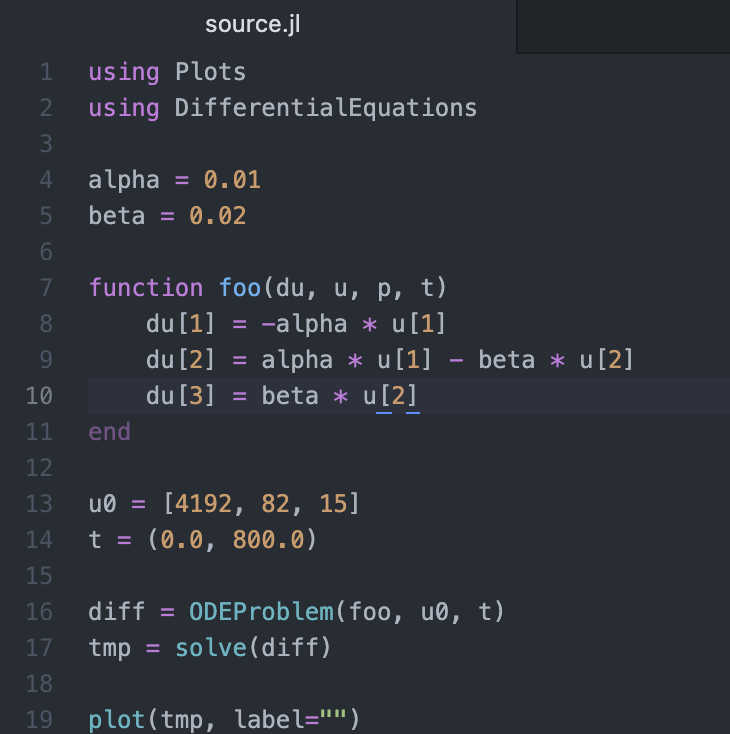
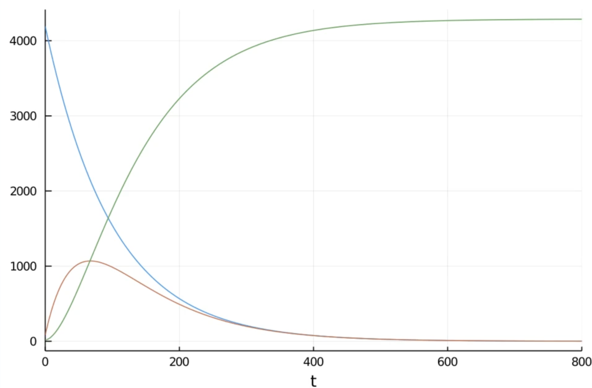

---
## Front matter
lang: ru-RU
title: "Лабораторная работа № 6"
subtitle: "Задача об эпидемии"
author: "Абакумов Егор Александрович"

## Formatting
toc: false
slide_level: 2
theme: metropolis
header-includes: 
 - \metroset{progressbar=frametitle,sectionpage=progressbar,numbering=fraction}
 - '\makeatletter'
 - '\beamer@ignorenonframefalse'
 - '\makeatother'
aspectratio: 43
section-titles: true
---

## Цель работы

Промоделировать протекание эпидемии в изолированной популяции.

## Задание

{ #fig:001 width=100% }

## Выполнение

 1. Рассмотрение теоретической части
 
 2. Написание кода
 
 3. Оформление отчета и презентации

## Результат

В результате был получен  программный код , 2 графика для изолируемых больных и для неизолируемых больных.

## Код программы 1-ый вариант

{ #fig:002 width=100% }

## График первого случая

{ #fig:003 width=100% }

## Код программы 2-ой вариант

{ #fig:004 width=100% }

## График для второго случая

{ #fig:005 width=100% }

##Вывод

- В ходе работы была успешно промоделирована эпидемия в закрытой популяции.