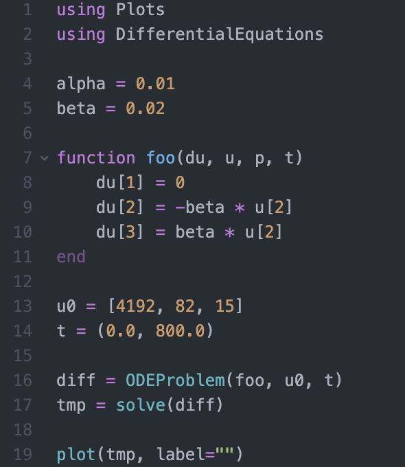
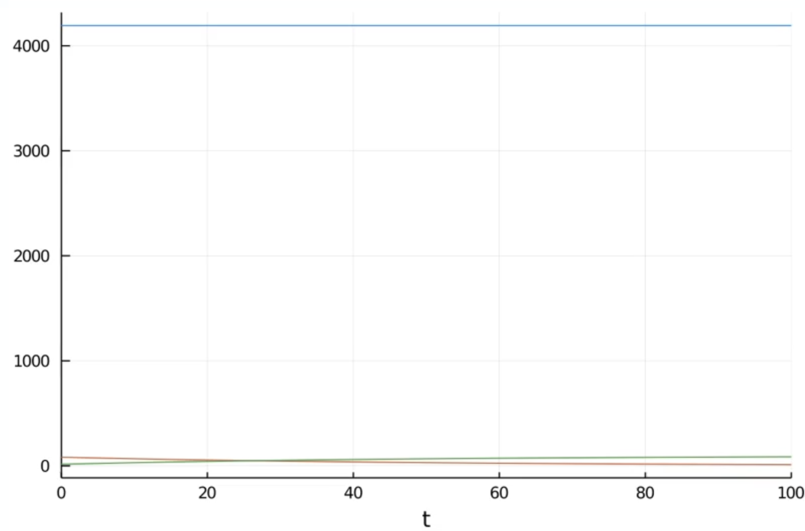
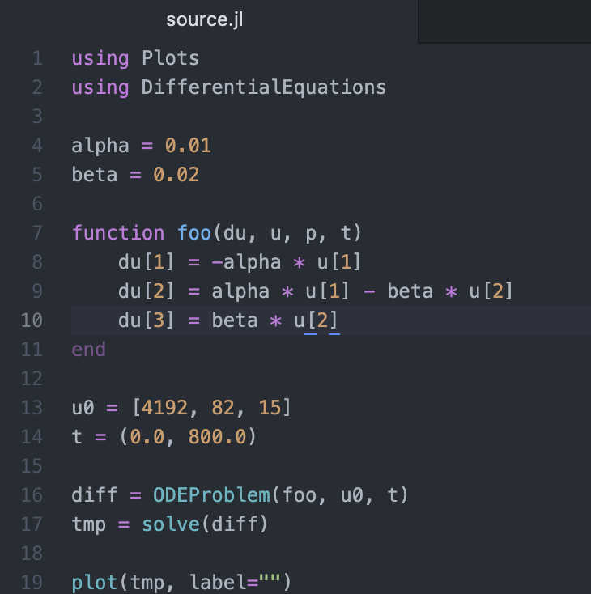
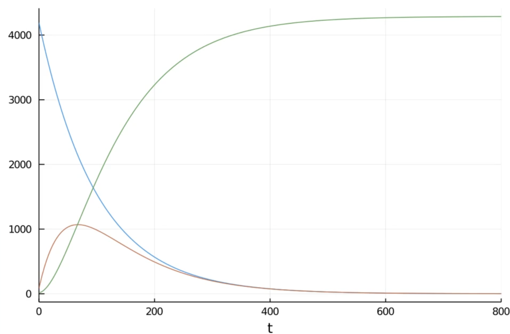

---
# Front matter
lang: ru-RU
title: "Лабораторная работа №6"
subtitle: "Задача об эпидемии"
author: "Абакумов Егор Александрович"

# Formatting
toc-title: "Содержание"
toc: true
toc_depth: 2
lof: true
lot: true
fontsize: 12pt
linestretch: 1.5
papersize: a4paper
documentclass: scrreprt
polyglossia-lang: russian
polyglossia-otherlangs: english
mainfont: PT Serif
romanfont: PT Serif
sansfont: PT Sans
monofont: PT Mono
mainfontoptions: Ligatures=TeX
romanfontoptions: Ligatures=TeX
sansfontoptions: Ligatures=TeX,Scale=MatchLowercase
monofontoptions: Scale=MatchLowercase
indent: true
pdf-engine: lualatex
header-includes:
  - \linepenalty=10
  - \interlinepenalty=0
  - \hyphenpenalty=50
  - \exhyphenpenalty=50
  - \binoppenalty=700
  - \relpenalty=500
  - \clubpenalty=150
  - \widowpenalty=150
  - \displaywidowpenalty=50
  - \brokenpenalty=100
  - \predisplaypenalty=10000
  - \postdisplaypenalty=0
  - \floatingpenalty = 20000
  - \usepackage{float}
  - \floatplacement{figure}{H}
---

# Теоретическое введение

Рассмотрим простейшую модель эпидемии. Предположим, что некая популяция (изолированная) из N особей подразделяется на 3 группы. Первая - восприимчивые к болезни здоровые особи, обозначим их S(t). Вторая - число инфицированных распространителей болезни, обозначим их I(t). Третья - здоровые люди с иммунитетом, обозначим R(t).

До того, как число заболевших не превышает критического значения $I^*$, считаем, что все больные изолированы и не заражают здоровых. Когда же $I(t)\leq I^*$, тогда инфицированные заражают здоровых. Тогда скорость изменения числа S(t) изменяется по закону:

$$\frac{dS}{dt} = \left\{\begin{matrix} -\alpha S, I(t)>I^* \\ 0, I(t)\leq I^* \end{matrix}\right.$$

Поскольку каждая восприимчивая к болезни особь, которая, в конце концов, заболеваем, сама становится инфекционной, то скорость изменения числа инфекционных особей представляет разность за единицу времени между заразившимися и теми, кто уже болеет и лечится, т.е.:

$$\frac{dI}{dt} = \left\{\begin{matrix} \alpha S - \beta I, I(t)>I^* \\ -\beta I I(t)\leq I^* \end{matrix}\right.$$
 
А скорость изменения выздоравливающих особей (при этом приобретающие иммунитет к болезни):
     
$$\frac{dR}{dt} = \beta I$$

Постояныые пропорциональности $\alpha, \beta$ - это коэффициенты заболеваемости и выздоровления соответственно.

Для того, чтобы решения соответствующих уравнений определялись однозначно, необходимо задать начальные условия, которые будут заданы в ходе решения задачи.

# Задание

**Вариант 50**

На одном острове вспыхнула эпидемия. Известно, что из всех проживающих на острове (N=4 289 в момент начала эпидемии (t=0) число заболевших людей
(являющихся распространителями инфекции) I(0)=82, А число здоровых людей с иммунитетом к болезни R(0)=15. Таким образом, число людей восприимчивых к болезни, но пока здоровых, в начальный момент времени S(0) = N - I(0) - R(0).
Постройте графики изменения числа особей в каждой из трех групп. Рассмотрите, как будет протекать эпидемия в случае:

1. $I(t)\leq I^* ,$

2. $I(t) > I^* .$

# Ход работы

1. Пишем программный код для решения задачи (Figure -@fig:001). Здесь альфа и бета - переменные для коэффициента выздоровления и заболеваемости, foo - функция вычисления уравнения, u0 - начальные условия, t - время моделирования, diff и tmp - временные переменные для хранения графика, а функция plot рисует график.

{ #fig:001 width=100% }

2. В результате получаем следующий график, где видим, что достаточно быстро число выздоровевших сравнивается с числом больных, которые вскоре все выздоравливают, а здоровые вообще не изменились в численности (Figure -@fig:002).

{ #fig:002 width=100% }

3. Теперь для изменения случая примем, что скорость изменения числа здоровых ненулевая. Тогда функция и код изменятся и примут следующий вид (Figure -@fig:003).

{ #fig:003 width=100% }

4. В результате получим график (Figure -@fig:004). По нему видим, что число здоровых уменьшается к нулю, то есть все люди переболели, число инфицированных сначала растет, но после перегиба в момент равенства с выздоровевшими начинает снижаться к нулю, а количество выздоровевших со временем становится равно N.

{ #fig:004 width=100% }

# Вывод

В ходе работы мы успешно промоделировали распространение эпидемии и построили наглядные графики.
