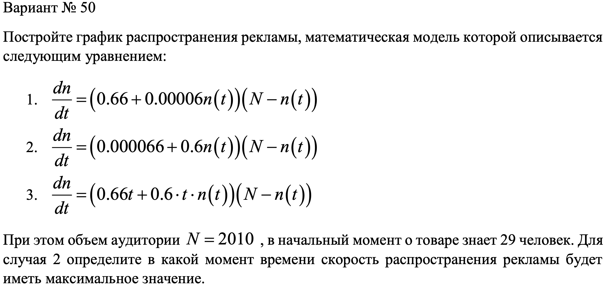
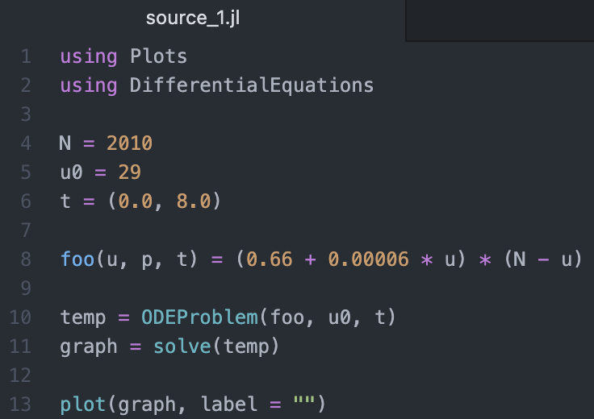
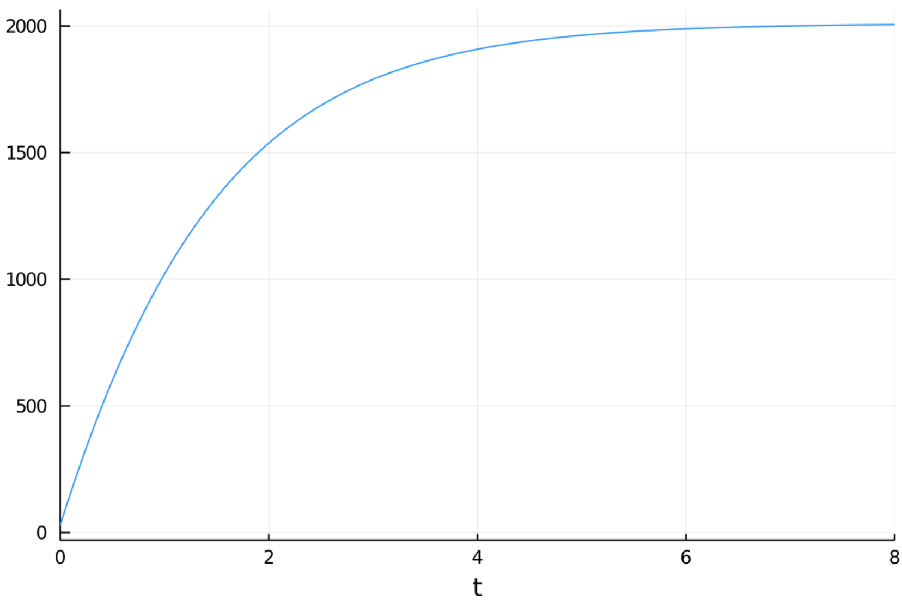
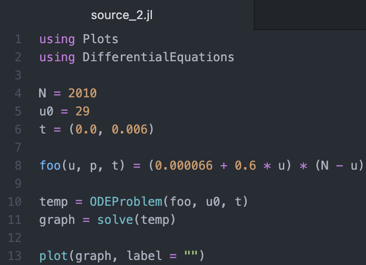
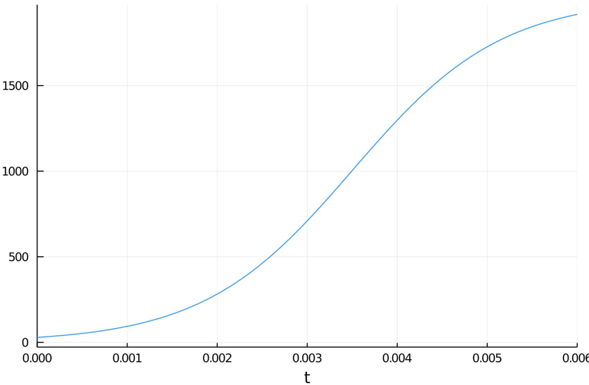
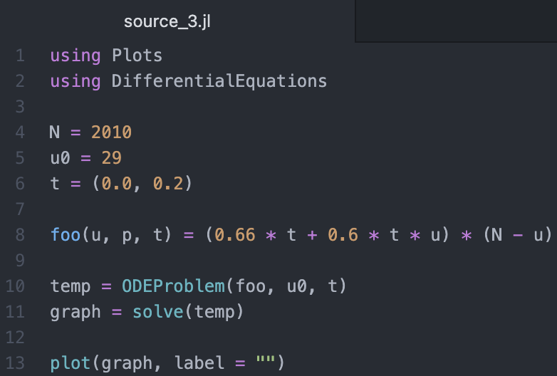
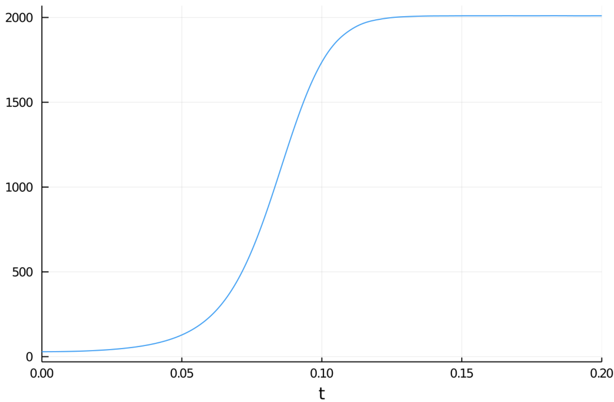

---
## Front matter
lang: ru-RU
title: "Лабораторная работа № 7"
subtitle: "Эффективность рекламы"
author: "Абакумов Егор Александрович"

## Formatting
toc: false
slide_level: 2
theme: metropolis
header-includes: 
 - \metroset{progressbar=frametitle,sectionpage=progressbar,numbering=fraction}
 - '\makeatletter'
 - '\beamer@ignorenonframefalse'
 - '\makeatother'
aspectratio: 43
section-titles: true
---

## Цель работы

Промоделировать распространение рекламы в трех различных заданных ситуациях.

## Задание

{ #fig:001 width=100% }

## Выполнение

 1. Рассмотрение теоретической части
 
 2. Написание кода
 
 3. Оформление отчета и презентации

## Результат

В результате было получено 3 варианта программного кода, график для каждого, то есть промоделированы 3 различные ситуации. Для второго случая построен график для определения момента максимальной скорости распространения рекламы.

## Код программы для 1-го варианта

{ #fig:002 width=72% }

## График первого случая

{ #fig:003 width=100% }

## Код программы для 2-го варианта

{ #fig:004 width=72% }

## График для второго случая

{ #fig:005 width=100% }

## Код программы для 3-го варианта

{ #fig:006 width=72% }

## График для третьего случая

{ #fig:007 width=100% }

## Вывод

- В ходе работы была успешно промоделировано распространение рекламы  в закрытой популяции.