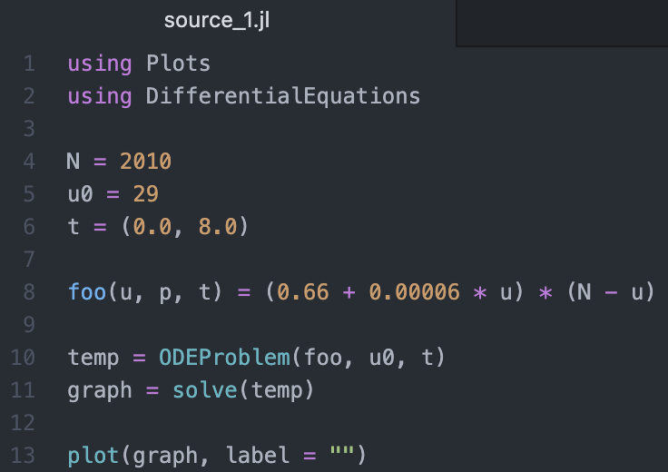
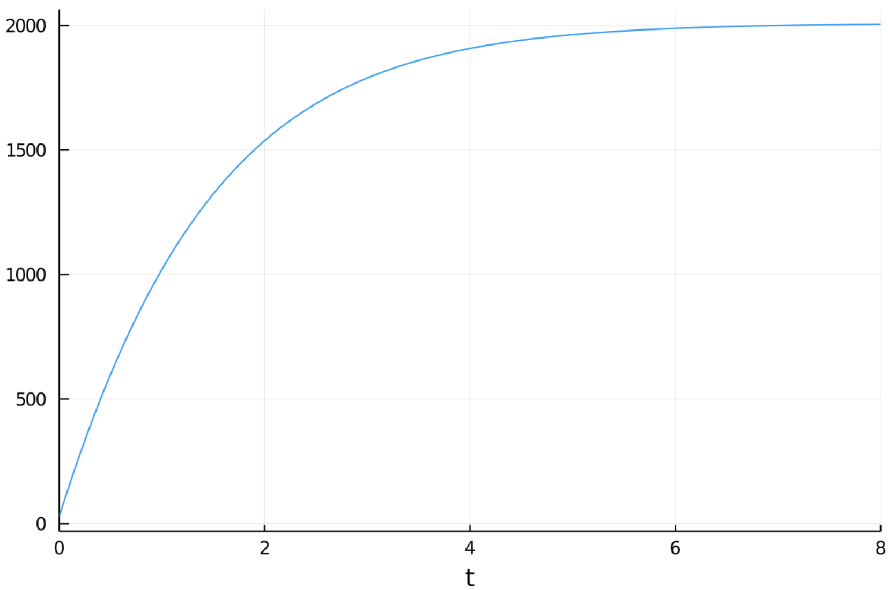
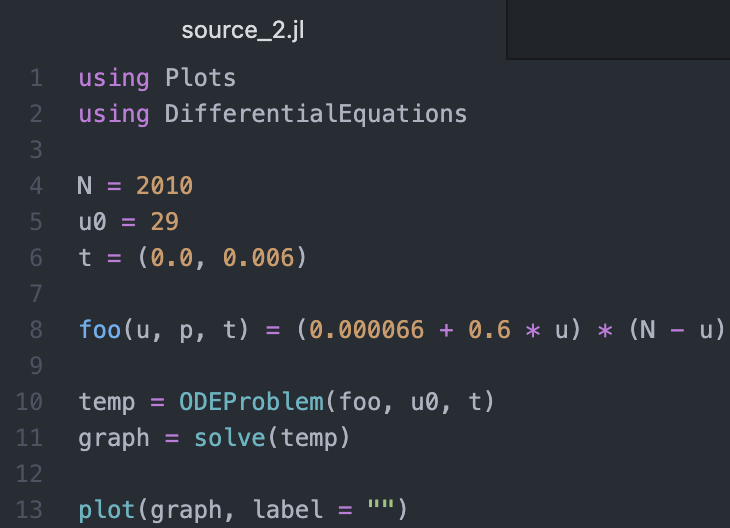
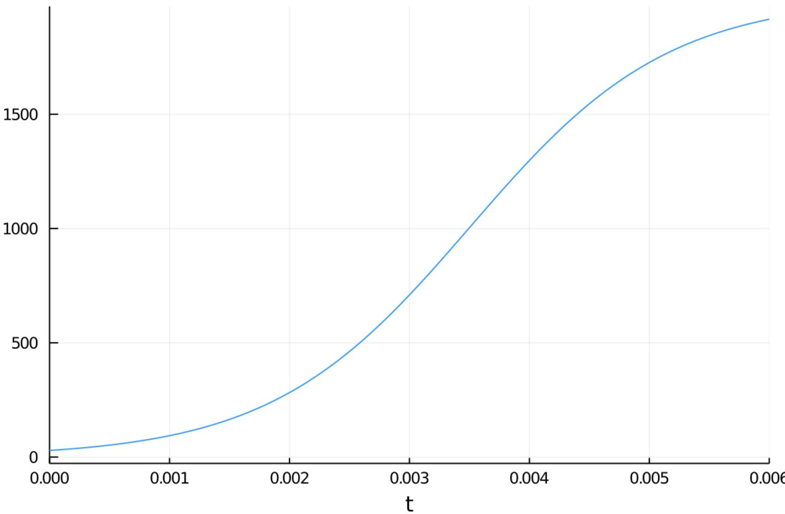
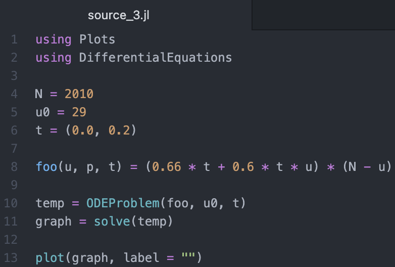
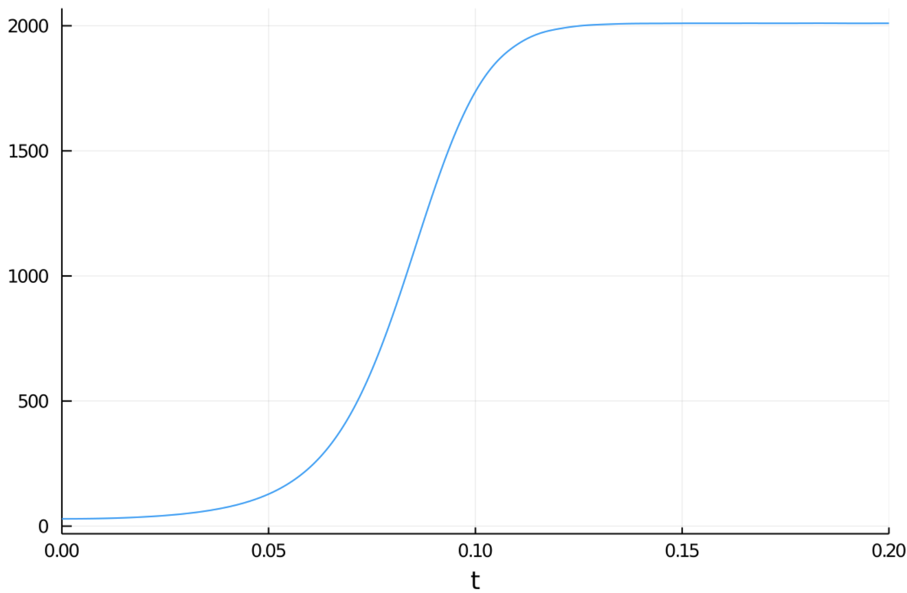

---
# Front matter
lang: ru-RU
title: "Лабораторная работа № 7"
subtitle: "Эффективность рекламы"
author: "Абакумов Егор Александрович"

# Formatting
toc-title: "Содержание"
toc: true
toc_depth: 2
lof: true
lot: true
fontsize: 12pt
linestretch: 1.5
papersize: a4paper
documentclass: scrreprt
polyglossia-lang: russian
polyglossia-otherlangs: english
mainfont: PT Serif
romanfont: PT Serif
sansfont: PT Sans
monofont: PT Mono
mainfontoptions: Ligatures=TeX
romanfontoptions: Ligatures=TeX
sansfontoptions: Ligatures=TeX,Scale=MatchLowercase
monofontoptions: Scale=MatchLowercase
indent: true
pdf-engine: lualatex
header-includes:
  - \linepenalty=10
  - \interlinepenalty=0
  - \hyphenpenalty=50
  - \exhyphenpenalty=50
  - \binoppenalty=700
  - \relpenalty=500
  - \clubpenalty=150
  - \widowpenalty=150
  - \displaywidowpenalty=50
  - \brokenpenalty=100
  - \predisplaypenalty=10000
  - \postdisplaypenalty=0
  - \floatingpenalty = 20000
  - \usepackage{float}
  - \floatplacement{figure}{H}
---

# Теоретическое введение

Модель рекламной кампании описывается следующими величинами. Считаем, что $\frac{dn}{dt}$ - скорость изменения со временем числа потребителей, узнавших о товаре и готовых его купить, $t$ - время, прошедшее с начала рекламной кампании, $n(t)$ - число уже информированных клиентов. Эта величина пропорциональна числу покупателей, еще не знающих о нем, это описывается следующим образом: $\alpha_1 (t) (N - n(t))$, где $N$ - общее число потенциальных платежеспособных покупателей, $\alpha_1 (t) > 0$ - характеризует интенсивность рекламной кампании (зависит от затрат на рекламу в данный момент времени). Помимо этого, узнавшие о товаре потребители также распространяют полученную информацию среди потенциальных покупателей, не знающих о нем (в этом случае работает т.н. сарафанное радио). Этот вклад в рекламу описывается величиной $\alpha_2 (t) n(t) (N - n(t))$, эта величина увеличивается с увеличением потребителей узнавших о товаре. Математическая модель распространения рекламы описывается уравнением:

$$\frac{dn}{dt}=(\alpha_1 (t) + \alpha_2 (t) n(t))(N - n(t))$$

# Задание

**Вариант 50**

Постройте график распространения рекламы, математическая модель которой описывается следующим уравнением:

1. $\frac{dn}{dt}=(0.66 + 0.00006n(t))(N - n(t))$

2. $\frac{dn}{dt}=(0.000066 + 0.6n(t))(N - n(t))$

3. $\frac{dn}{dt}=(0.66t + 0.6\cdot t \cdot n(t))(N - n(t))$

При этом объем аудитории $N = 2010$, в начальный момент о товаре знает 29 человек. Для случая 2 определите в какой момент времени скорость распространения рекламы будет иметь максимальное значение.

# Ход работы

1. Напишем код для первого случая (иллюстр. -@fig:001). Здесь N - популяция, u0 - количество осведомленных о товаре людей в начальный момент времени, t - временной промежуток наблюдения, foo - функция решения, u - рабочая переменная, переменные temp и graph - временные переменные для хранения промежуточных результатов.

{ #fig:001 width=73% }

2. В результате получим график для первого случая (иллюстр. -@fig:002).

{ #fig:002 width=100% }

3. Далее поменяем коэффициенты  $\alpha_1$ и $\alpha_2$, получив тем самым второе уравнение (иллюстр. -@fig:003).

{ #fig:003 width=73% }

4. В результате получим следующий график, по которому вычислим момент максимальной скорости распространения рекламы: $t = 0.0035; \; n = 1000$ (иллюстр. -@fig:004).

{ #fig:004 width=100% }

5. Теперь снова изменим ситуацию, добавив влияние внешних условий на коффициенты $\alpha_1$ и $\alpha_2$ для получения третьего уравнения (иллюстр. -@fig:005).

{ #fig:005 width=73% }

6. В результате получим следующий график (иллюстр. -@fig:006).

{ #fig:006 width=100% }

# Ответы на контрольные вопросы

1. Записать модель Мальтуса (дать пояснение, где используется данная модель).

Модель Мальтуса имеет следующий вид:

$$P(t) = P_0 e^{rt},$$

где $P_0 = P(0)$ — численность, $r$ — темп прироста населения (т. н. «мальтузианский параметр»), а $t$ — время.

2. Записать уравнение логистической кривой (дать пояснение, что описывает данное уравнение).

Уравнение логистической кривой имеет следующий вид:

 $$\frac{dP}{dt} = rP(1 - \frac{P}{K}),$$

где $P$ — численность популяции, $r$ — скорость роста популяции, а $K$ — поддерживающая ёмкость среды (верхняя граница численности популяции).

3. На что влияет коэффициент $\alpha_1 (t)$ и $\alpha_2 (t)$ в модели распространения рекламы?

Коэффициент $\alpha_1 (t)$ характеризует интенсивность рекламной компании.

Коэффициент $\alpha_2 (t)$ характеризует эффект "сарафанного радио".

4. Как ведет себя рассматриваемая модель при $\alpha_1 (t) >> \alpha_2 (t)$ ?

Модель принимает вид модели Мальтуса.

5. Как ведет себя рассматриваемая модель при $\alpha_1 (t) << \alpha_2 (t)$ ?

Модель принимает вид логистической кривой.

# Вывод

В ходе работы мы успешно промоделировали распространение рекламы в трех различных ситуациях, построили графики для каждой и ответили на все контрольные вопросы.