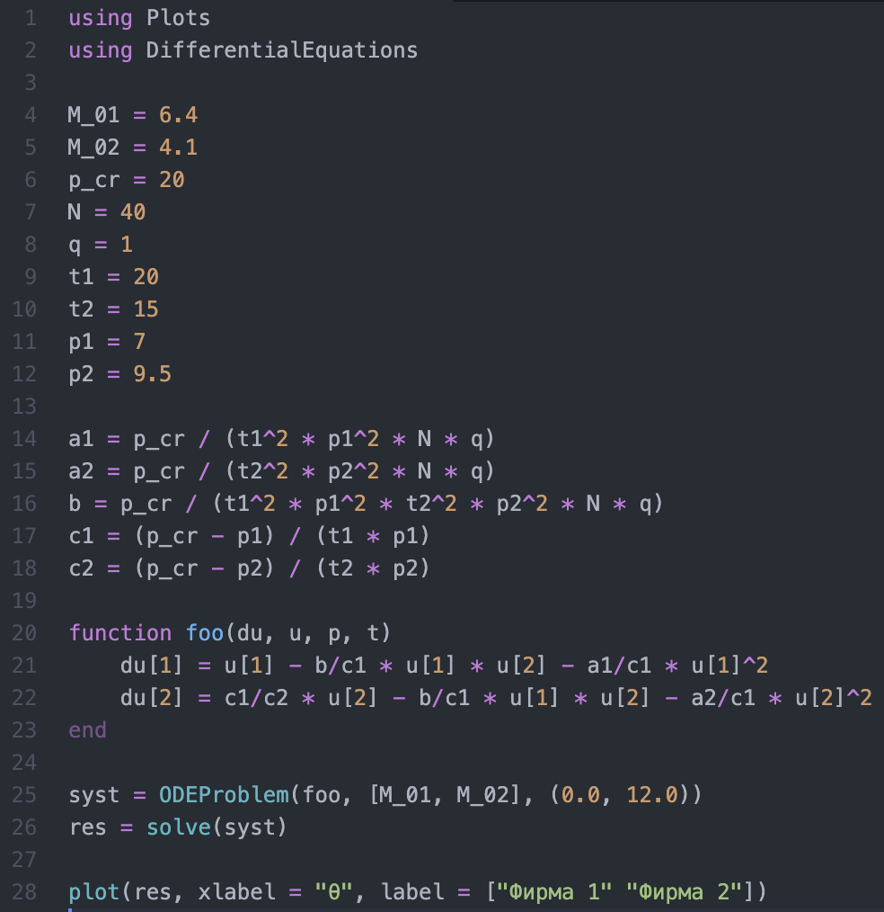
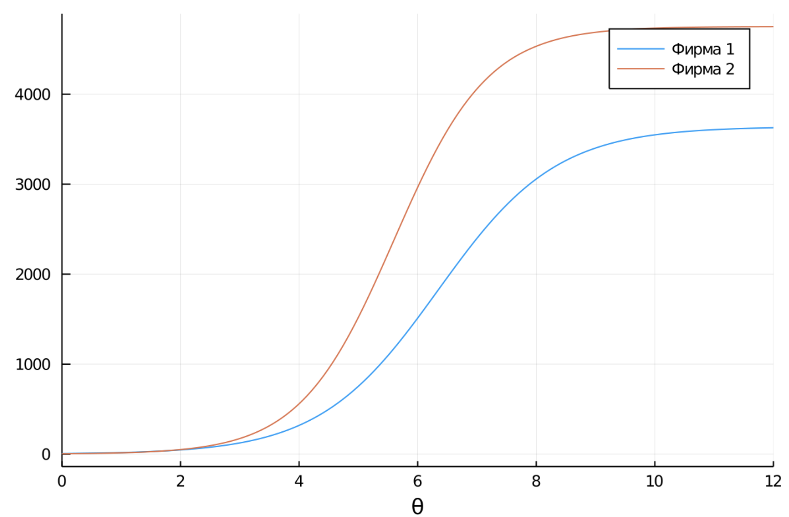
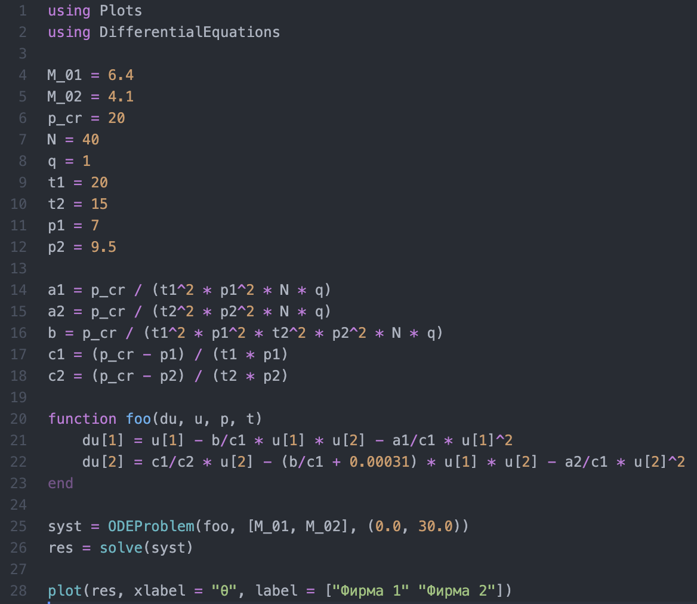
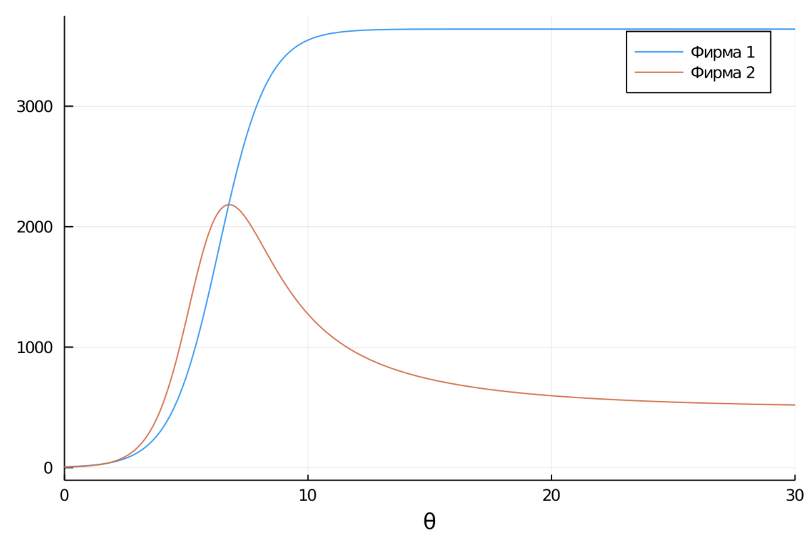

---
## Front matter
lang: ru-RU
title: "Лабораторная работа № 8"
subtitle: "Модель конкуренции двух фирм"
author: "Абакумов Егор Александрович"

## Formatting
toc: false
slide_level: 2
theme: metropolis
header-includes: 
 - \metroset{progressbar=frametitle,sectionpage=progressbar,numbering=fraction}
 - '\makeatletter'
 - '\beamer@ignorenonframefalse'
 - '\makeatother'
aspectratio: 43
section-titles: true
---

## Цель работы

Промоделировать конкуренцию двух фирм в двух различных заданных ситуациях.

## Задание

**Вариант 50**

Случай 1. 
Постройте графики изменения оборотных средств фирмы 1 и фирмы 2 без учета постоянных издержек и с веденной нормировкой для случая 1, описываемого следующей системой уравнений:

$$\left\{\begin{matrix} \frac{dM_1}{d\theta} = M_1 - \frac{b}{c_1} M_1 M_2 - \frac{a_1}{c_1} M_1^2 \\ \frac{dM_2}{d\theta} = \frac{c_2}{c_1} M_2 - \frac{b}{c_1} M_1 M_2 - \frac{a_2}{c_1} M_2^2 \end{matrix}\right.$$

## Задание

Случай 2. 
Постройте графики изменения оборотных средств фирмы 1 и фирмы 2 без учета постоянных издержек и с веденной нормировкой для случая 2, описываемого следующей системой уравнений:

$$\left\{\begin{matrix} \frac{dM_1}{d\theta} = M_1 - \frac{b}{c_1} M_1 M_2 - \frac{a_1}{c_1} M_1^2 \\ \frac{dM_2}{d\theta} = \frac{c_2}{c_1} M_2 - (\frac{b}{c_1} + 0.00031) M_1 M_2 - \frac{a_2}{c_1} M_2^2 \end{matrix}\right.$$

Начальные условия:
$$M_0^1 = 6.4, M_0^2 = 4.1, p_{cr} = 20, N = 40, q = 1, \tau_1 = 20, \tau_2 = 15,$$
$$\tilde{p_1} = 7, \tilde{p_2} = 9.5.$$

***Замечание:*** значения $p_{cr}, \tilde{p_{1,2}}, N$ указаны в тысячах единиц, а значения $M_{1,2}$ указаны в млн. единиц.

## Обозначения

 - $N$ – число потребителей производимого продукта; 

 - $\tau$ – длительность производственного цикла; 

 - $p$ – рыночная цена товара;

 - $\tilde{p}$ – себестоимость продукта;

 - $q$ – максимальная потребность одного человека в продукте в единицу времени;

 - $d\theta = \frac{t}{c_1}$ – безразмерное время.

## Код программы для 1-го варианта

{ #fig:001 width=72% }

## График первого случая

{ #fig:002 width=100% }

## Код программы для 2-го варианта

{ #fig:003 width=72% }

## График для второго случая

{ #fig:004 width=100% }

## Результат

В результате было получено 2 варианта программного кода для различных моделей конкуренции, для каждой ситуации получен свой график. 

## Вывод

- В ходе работы была успешно промоделирована конкуренция двух фирм.