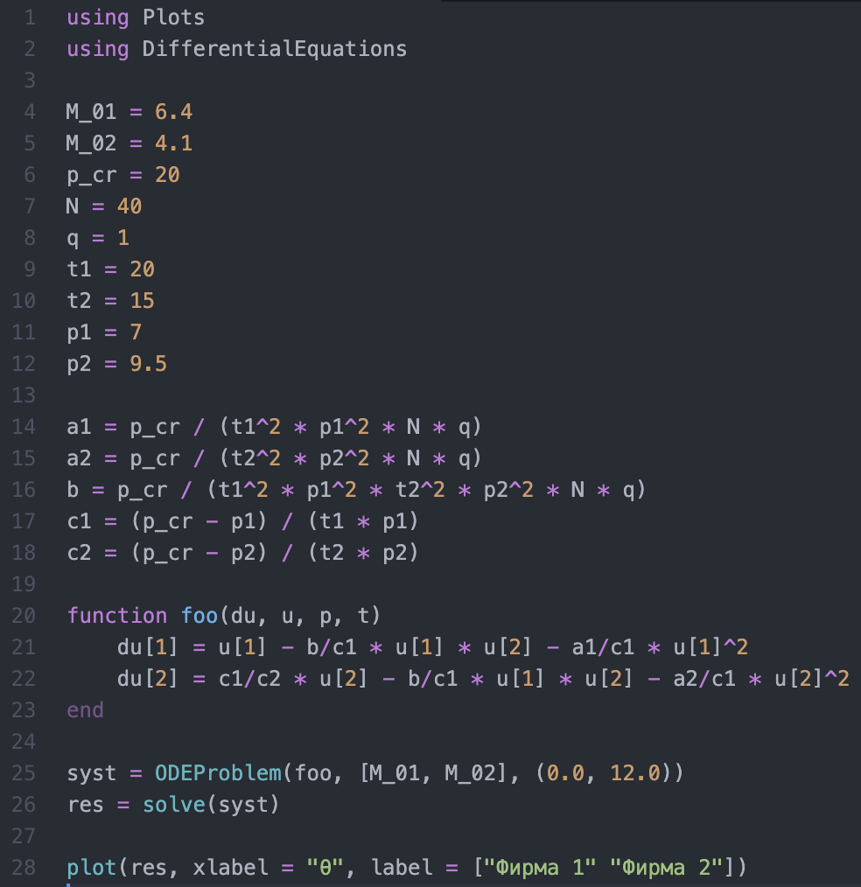
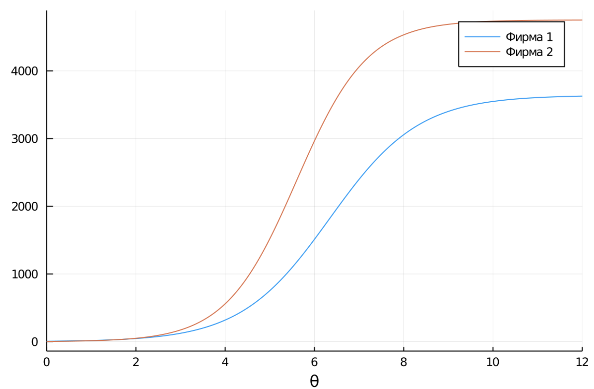
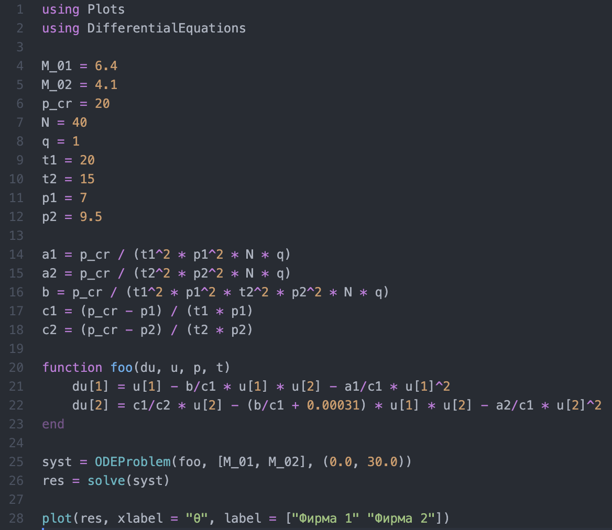
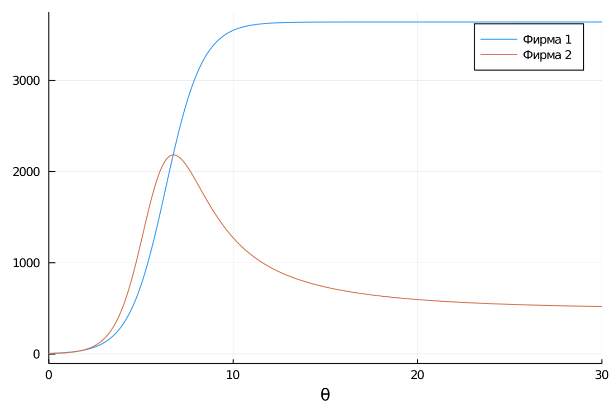

---
# Front matter
lang: ru-RU
title: "Лабораторная работа № 8"
subtitle: "Модель конкуренции двух фирм"
author: "Абакумов Егор Александрович"

# Formatting
toc-title: "Содержание"
toc: true
toc_depth: 2
lof: true
lot: true
fontsize: 12pt
linestretch: 1.5
papersize: a4paper
documentclass: scrreprt
polyglossia-lang: russian
polyglossia-otherlangs: english
mainfont: PT Serif
romanfont: PT Serif
sansfont: PT Sans
monofont: PT Mono
mainfontoptions: Ligatures=TeX
romanfontoptions: Ligatures=TeX
sansfontoptions: Ligatures=TeX,Scale=MatchLowercase
monofontoptions: Scale=MatchLowercase
indent: true
pdf-engine: lualatex
header-includes:
  - \linepenalty=10
  - \interlinepenalty=0
  - \hyphenpenalty=50
  - \exhyphenpenalty=50
  - \binoppenalty=700
  - \relpenalty=500
  - \clubpenalty=150
  - \widowpenalty=150
  - \displaywidowpenalty=50
  - \brokenpenalty=100
  - \predisplaypenalty=10000
  - \postdisplaypenalty=0
  - \floatingpenalty = 20000
  - \usepackage{float}
  - \floatplacement{figure}{H}
---

# Теоретическое введение

Для построения модели конкуренции хотя бы двух фирм необходимо рассмотреть модель одной фирмы. Вначале рассмотрим модель фирмы, производящей продукт долговременного пользования, когда цена его определяется балансом спроса и предложения. Примем, что этот продукт занимает определенную нишу рынка и конкуренты в ней отсутствуют.

Обозначим:

$N$ – число потребителей производимого продукта.

$S$ – доходы потребителей данного продукта. Считаем, что доходы всех потребителей одинаковы. Это предположение справедливо, если речь идет об одной рыночной нише, т.е. производимый продукт ориентирован на определенный слой населения.

$M$ – оборотные средства предприятия

$\tau$ – длительность производственного цикла

$p$ – рыночная цена товара

$\tilde{p}$ – себестоимость продукта, то есть переменные издержки на производство единицы продукции.

$\delta$ – доля оборотных средств, идущая на покрытие переменных издержек

При пренебрежимо малых издержках уравнения динамики оборотных средств будут выглядеть следующим образом:

$$\left\{\begin{matrix} \frac{dM_1}{dt} = c_1 M_1 - b M_1 M_2 - a_1 M_1^2 \\ \frac{dM_2}{dt} = c_2 M_2 - b M_1 M_2 - a_2 M_2^2 \end{matrix}\right.$$

$$a_1 = \frac{p_{cr}}{\tau_1^2 \tilde{p_1}^2 Nq}, a_2 = \frac{p_{cr}}{\tau_2^2 \tilde{p_2}^2 Nq}, b = \frac{p_{cr}}{\tau_1^2 \tilde{p_1}^2 \tau_2^2 \tilde{p_2}^2 Nq}, c_1 = \frac{p_{cr} - \tilde{p_1}}{\tau_1 \tilde{p_1}}, c_2 = \frac{p_{cr} - \tilde{p_2}}{\tau_2 \tilde{p_2}}$$

Введем нормировку $t = c_1 \theta$:

$$\left\{\begin{matrix} \frac{dM_1}{d\theta} = M_1 - \frac{b}{c_1} M_1 M_2 - \frac{a_1}{c_1} M_1^2 \\ \frac{dM_2}{d\theta} = \frac{c_2}{c_1} M_2 - \frac{b}{c_1} M_1 M_2 - \frac{a_2}{c_1} M_2^2 \end{matrix}\right.$$

# Задание

**Вариант 50**

1. Постройте графики изменения оборотных средств фирмы 1 и фирмы 2 без учета постоянных издержек и с веденной нормировкой для случая 1, описываемого следующей системой уравнений:

$$\left\{\begin{matrix} \frac{dM_1}{d\theta} = M_1 - \frac{b}{c_1} M_1 M_2 - \frac{a_1}{c_1} M_1^2 \\ \frac{dM_2}{d\theta} = \frac{c_2}{c_1} M_2 - \frac{b}{c_1} M_1 M_2 - \frac{a_2}{c_1} M_2^2 \end{matrix}\right.$$

2. Постройте графики изменения оборотных средств фирмы 1 и фирмы 2 без учета постоянных издержек и с веденной нормировкой для случая 2, описываемого следующей системой уравнений:

$$\left\{\begin{matrix} \frac{dM_1}{d\theta} = M_1 - \frac{b}{c_1} M_1 M_2 - \frac{a_1}{c_1} M_1^2 \\ \frac{dM_2}{d\theta} = \frac{c_2}{c_1} M_2 - (\frac{b}{c_1} + 0.00031) M_1 M_2 - \frac{a_2}{c_1} M_2^2 \end{matrix}\right.$$

Начальные условия:

$$M_0^1 = 6.4, M_0^2 = 4.1, p_{cr} = 20, N = 40, q = 1, \tau_1 = 20, \tau_2 = 15, \tilde{p_1} = 7, \tilde{p_2} = 9.5.$$

***Замечание:*** значения $p_{cr}, \tilde{p_{1,2}}, N$ указаны в тысячах единиц, а значения $M_{1,2}$ указаны в млн. единиц.

***Обозначения:*** 

$N$ – число потребителей производимого продукта; 

$\tau$ – длительность производственного цикла; 

$p$ – рыночная цена товара;

$\tilde{p}$ – себестоимость продукта;

$q$ – максимальная потребность одного человека в продукте в единицу времени;

$d\theta = \frac{t}{c_1}$ – безразмерное время.

# Ход работы

1. Напишем код для первого случая (иллюстр. -@fig:001). Здесь M_01, M_02 - капитализация первой и второй фирмы, p_cr - критическая цена, N - кол-во потребителей, q - максимальная потребность одного человека в продукте в единицу времени, t1, t2 - время производственного цикла, p1, p2 - цена товара. Функция foo моделирует систему двух уравнений, u - переменная для M, syst и res - временные технические переменные.

{ #fig:001 width=73% }

2. В результате получим график для первого случая (иллюстр. -@fig:002).

{ #fig:002 width=100% }

3. Далее изменим код под второй случай, добавив эффект действия конкурента на покупателей фирмы (иллюстр. -@fig:003).

{ #fig:003 width=73% }

4. В результате получим следующий график (иллюстр. -@fig:004).

{ #fig:004 width=100% }

# Вывод

В ходе работы мы в различных условиях промоделировали конкуренцию двух фирм, получили и проанализировали графики их взаимодействия.